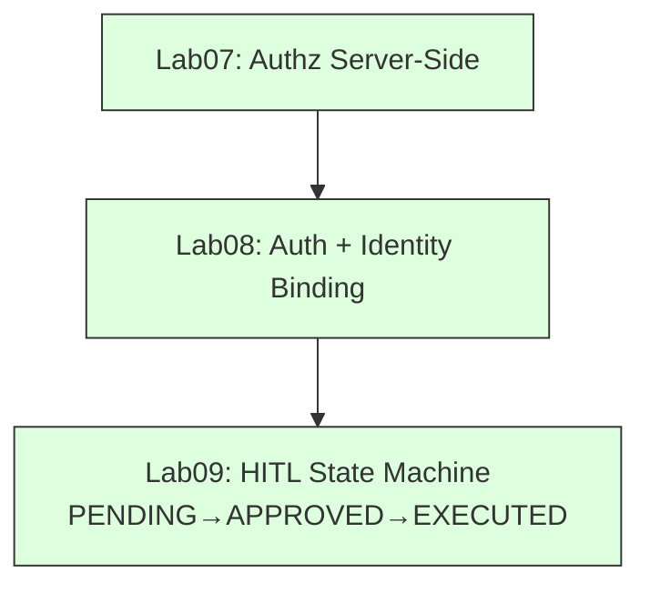

# Cyber-MCP-Lab Architecture Overview

This document captures the architectural evolution of the cyber-mcp-lab repository across Labs 01‑10. It preserves the technically correct content from the original Lab 06 architecture while extending it to cover the full progression.

## Labs 01‑05: Foundational MCP Concepts

### Lab 01 – Basic MCP Architecture
- OpenCode acts as an **MCP Host** that runs an LLM.
- The host contains an **MCP Client** which connects to one or more **MCP Servers**.
- Each server exposes **Tools**, **Resources**, and **Prompts** following the MCP specification.

### Lab 02 – MCP Server as REST Adapter
- An MCP server wraps an external REST API (e.g., AbuseIPDB) and presents it as a Tool.
- Flow: OpenCode → MCP Client → Threat‑Intel MCP Server → AbuseIPDB REST API.
- Demonstrates that MCP does **not** replace REST; it adapts them.

### Lab 03 – Multiple Tools per Server
- A single MCP server can expose several cybersecurity Tools (e.g., check_ip, check_hash, parse_log).
- Tool availability does **not** imply automatic invocation; the LLM decides when to call a Tool.

### Lab 04 – Resources and Templates
- Servers expose **Resources** via MCP URIs (e.g., `cyber://assets`, `cyber://assets/{id}`, `cyber://events/recent`, `cyber://runtime/session`).
- **Resource templates** allow pattern‑based URIs.
- **Dynamic resources** compute URIs at runtime but do **not** guarantee a fresh read; they may be cached.

### Lab 05 – Read‑Only SIEM Integration
- One MCP server provides read‑only access to a SIEM:
  - **Tools** for executing queries (`search_events`).
  - **Resources** for direct contextual data (e.g., recent alerts).
- Reinforces that resource access is separate from tool invocation.

### Diagram 1: Labs 01‑05 Evolution
```mermaid
flowchart TD
    A[OpenCode / LLM Host] --> B[MCP Client]
    B --> C1[Lab01: Single Server<br/>Tool/Resource/Prompt]
    B --> C2[Lab02: Server ↔ REST API<br/>(Adapter)]
    B --> C3[Lab03: Multi‑Tool Server]
    B --> C4[Lab04: Resource URIs & Templates]
    B --> C5[Lab05: SIEM Read‑Only<br/>(Tools + Resources)]
    style A fill:#f9f,stroke:#333,stroke-width:2px
    style B fill:#bbf,stroke:#333,stroke-width:2px
    style C1 fill:#dfd,stroke:#333,stroke-width:1px
    style C2 fill:#dfd,stroke:#333,stroke-width:1px
    style C3 fill:#dfd,stroke:#333,stroke-width:1px
    style C4 fill:#dfd,stroke:#333,stroke-width:1px
    style C5 fill:#dfd,stroke:#333,stroke-width:1px
```

## Lab 06 – Multiple MCP Servers
- The host can connect to **multiple MCP servers** simultaneously.
- Example: `cyber-siem` (SIEM) and `cyber-ti` (Threat Intel) both available to the same LLM.
- The LLM orchestrates evidence fusion but **does not** enforce security; each server enforces its own access control.

### Diagram 2: Multi‑MCP Architecture (Lab 06)
```mermaid
flowchart LR
    A[OpenCode / LLM] --> B[MCP Client]
    B --> C[cyber-siem<br/>search_events]
    B --> D[cyber-ti<br/>check_ip]
    C --> E[Evidence Fusion<br/>(LLM)]
    D --> E
    style A fill:#f9f,stroke:#333,stroke-width:2px
    style B fill:#bbf,stroke:#333,stroke-width:2px
    style C fill:#dfd,stroke:#333,stroke-width:1px
    style D fill:#dfd,stroke:#333,stroke-width:1px
    style E fill:#ffd,stroke:#333,stroke-width:1px
```

### Lab 06 Content (preserved)
- Component description and transport (stdio) remain unchanged.

## Labs 07‑09: Security Controls Evolution

### Lab 07 – Identity & Authorization
- Authorization **must** be server‑side; LLM cannot override.
- Flow: Authentication → Verified identity → Security context → Authorization → MCP capability.
- Demonstrated the difference between claimed vs. authenticated identity.

### Lab 08 – Authentication & Identity Binding
- Credential‑based authentication (CYBERLAB_TOKEN) separates auth from authz.
- Identity bound to credential, not LLM claims.
- Default‑deny posture; read‑only scope limits leakage impact.

### Lab 09 – Human‑in‑the‑Loop (HITL) for High‑Impact Tools
- Introduces a server‑side state machine for proposals:
  `PENDING_APPROVAL → APPROVED → EXECUTED`.
- Approval enforced server‑side; LLM intent ≠ human approval.
- Execution only from stored proposal; duplicate execution rejected.

### Diagram 3: Security Control Evolution (Labs 07‑09)


## Lab 10 – Secure Agentic SOC Architecture
- Integrates three MCP servers:
   - `cyber-soc`: SOC evidence ingestion & triage.
   - `cyber-ti`: Threat‑intel lookups.
   - `cyber-response`: Authoritative proposal FSM & simulated response state.
- OpenCode/LLM acts **only** as orchestrator; it does **not** enforce security‑critical transitions.
- Data flow:
   1. **Observe** – query cyber‑soc & enrich with cyber‑ti.
   2. **Correlate & Reason** – LLM drafts proposal via cyber‑response `propose_action`.
   3. **Approve** – Human supplies approval code to cyber‑response `approve_action`.
   4. **Execute** – cyber‑response `execute_action` runs approved action.
   5. **Verify** – Independent verification via cyber‑response `get_security_state` and `verify_action` confirming that the action was executed and the resulting security state matches expectations, providing replay protection and target tampering prevention.
- Trust boundaries: each MCP server validates inputs server‑side; LLM never mutates state directly.
- Security principles preserved:
   - Authentication & authorization are server‑side.
   - HITL approval & action state are authoritative server‑side.
   - Provenance & freshness are security‑relevant but not cryptographically attested in this lab.
   - Secure components ≠ automatically secure composition.

### Diagram 4: Integrated Secure Agentic SOC (Lab 10)
```mermaid
flowchart LR
    A[OpenCode / LLM<br/>(Orchestrator)] --> B[MCP Client]
    B --> C[cyber-soc<br/>get_incidents, add_evidence]
    B --> D[cyber-ti<br/>check_ip, check_hash]
    B --> E[cyber-response<br/>propose_action, approve_action, execute_action, get_proposal_state]
    C --> F[Observe & Enrich]
    D --> F
    F --> G[LLM: Correlate & Reason<br/>→ propose_action]
    G --> H[Human: Approve Code<br/>→ approve_action]
    H --> I[cyber-response: Execute<br/>→ execute_action]
    I --> J[Verify: get_security_state / verify_action]
    style A fill:#f9f,stroke:#333,stroke-width:2px
    style B fill:#bbf,stroke:#333,stroke-width:2px
    style C fill:#dfd,stroke:#333,stroke-width:1px
    style D fill:#dfd,stroke:#333,stroke-width:1px
    style E fill:#dfd,stroke:#333,stroke-width:1px
    style F fill:#ffd,stroke:#333,stroke-width:1px
    style G fill:#ffd,stroke:#333,stroke-width:1px
    style H fill:#ffd,stroke:#333,stroke-width:1px
    style I fill:#ffd,stroke:#333,stroke-width:1px
    style J fill:#ffd,stroke:#333,stroke-width:1px
```

## Summary of Architectural Principles (Preserved)
- LLM ≠ Agent ≠ MCP.
- MCP adapts, does not replace, REST APIs.
- Tool/function calling and MCP are complementary.
- Tool/resource availability does not imply invocation/reading.
- Dynamic Resource ≠ Fresh Read.
- Authentication & authorization enforced server‑side.
- HITL approval & action state authoritative server‑side.
- Agent self‑review is not independent verification.
- Secure components do not guarantee secure composition.
- Provenance & freshness are security‑relevant.

---
*Only `docs/architecture.md` was modified to reflect the full Labs 01‑10 evolution and to include the four Mermaid diagrams above.*
